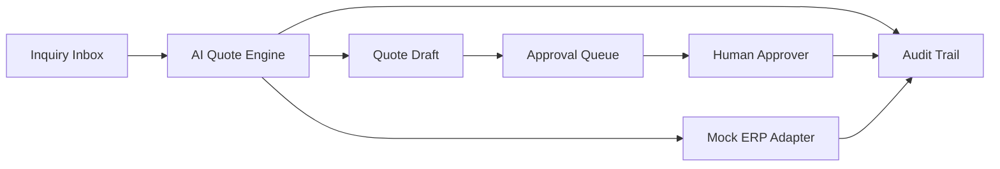

# Omni QuoteGate

AI drafts the quote. Your team decides. Every step is logged.

Omni QuoteGate shows the safer pattern for AI inside revenue operations: AI can read context and draft actions, but humans approve risky business decisions and every step is logged.

Omni QuoteGate is a controlled ERP sales automation demo for wholesale and distribution teams that need faster quote handling without giving automation final authority over risky decisions. The app simulates how a sales inquiry moves from message intake to product lookup, customer credit review, quote drafting, approval routing, and audit logging.

## What Makes It Different

This project is intentionally not a chatbot or support-ticket copilot. It focuses on revenue-facing inquiry handling, deterministic quote drafting, approval guardrails, and append-only audit history so the boundary between AI assistance and human control is visible in the product itself.

## Demo Workflow

1. Open the inquiry inbox.
2. Review a customer request from WhatsApp, email, or chat.
3. Analyze the inquiry to classify intent and match product/customer context.
4. Draft a quote using mocked ERP data.
5. Send risky quotes into the approval queue automatically.
6. Approve or reject and inspect the audit trail.

## Architecture



## Screenshots

Add screenshots after running the app locally:

- `docs/screenshots/dashboard.png`
- `docs/screenshots/inquiry-detail.png`
- `docs/screenshots/approvals.png`

## Tech Stack

- Python 3.12+
- FastAPI
- Jinja2 templates
- SQLAlchemy 2.x
- SQLite by default
- Pydantic v2
- Pytest
- Docker and docker-compose

## Mocked vs Production-Ready

Mocked in v1:

- ERP adapter uses local seeded data
- Inquiry sources are seeded examples, not live WhatsApp or email integrations
- Deterministic engine simulates AI behavior without a real LLM

Production-ready foundations:

- Clear adapter boundary for ERP integrations
- Environment-driven database configuration
- Approval and audit workflow separation
- JSON API plus server-rendered UI

## Local Setup

```bash
cp .env.example .env
python -m venv .venv
pip install -r requirements.txt
python scripts/seed_demo.py
uvicorn app.main:app --reload
```

## Docker Setup

```bash
cp .env.example .env
docker compose up --build
```

## Tests

```bash
python -m compileall app
pytest
```

## Roadmap

- Swap the deterministic engine in `app/services/ai_quote_engine.py` for a real LLM tool-calling layer. Its `classify_inquiry`, `lookup_product`, `lookup_customer`, and `propose_quote` interfaces already map to function-calling patterns.
- Replace the mock ERP adapter with an Odoo XML-RPC adapter.
- Add role-based authentication and secure approval actions.
- Lock down the demo reset endpoint for non-public environments.
- Add live channel ingestion for WhatsApp and email.

## Portfolio / Hire Me

Omni QuoteGate is designed as a portfolio project for ERP automation, Odoo integration planning, Python backend work, controlled AI operations, and sales workflow modernization. It is meant to show how AI assistance can fit into high-trust revenue processes without bypassing human approval.

## Known Limitations

- No authentication in v1
- `/admin/reset-demo` is intentionally open for demo convenience and would not be production-safe
- Deterministic engine is not a real LLM
- Mocked ERP only, with no live WhatsApp or Odoo integration
