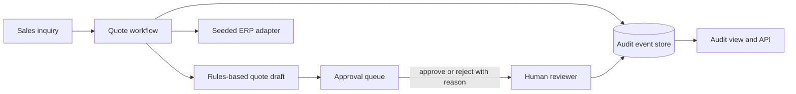

# Omni QuoteGate

A controlled quotation workflow that keeps approval decisions and their reasons visible in an auditable sales process.

[](https://github.com/gharisj3/omni-quotegate/actions/workflows/ci.yml)

## Why this exists

Sales teams need to respond to quote requests while checking stock, discounts, and customer credit. This reference app demonstrates deterministic quote drafting with a required human approval step for flagged cases. Its current quote engine is rules based; it does not call an LLM.

This is a public reimplementation of patterns I've used in production client work. Client code and data are not included.

## Architecture



- `app/services/ai_quote_engine.py` classifies inquiry text and computes a quote using deterministic rules.
- `app/services/mock_erp.py` supplies seeded customer, product, stock, and credit context.
- Approval rules route risky quotes for a human decision.
- SQLite stores inquiries, quote drafts, approvals, and audit events.

## Guardrails and security model

The quote engine can classify a request, read seeded ERP context, and prepare a draft. It cannot approve a quote. Stock, discount, saleability, and credit checks run in Python before an approval decision. The approval endpoints record the reviewer, decision, and rejection reason. The demo uses only synthetic seed records; no third-party messaging or model account is called.

## Quickstart

Requires Python 3.11 or newer.

```sh
python -m venv .venv
# Linux/macOS: . .venv/bin/activate
# Windows PowerShell: .\.venv\Scripts\Activate.ps1
make setup
make test
make demo
```

Start the interactive app with `uvicorn app.main:app --reload`. It uses the local SQLite database configured by `DATABASE_URL`.

## Demo

`make demo` creates an isolated temporary SQLite database, drafts a quote, rejects it with a reason, redrafts, approves, and prints the event sequence.

```text
Fixture mode: seeded local ERP records; no API or external service call.
{
  "steps": ["draft quote", {"reject": "Requested quantity exceeds available stock."}, "redraft quote", "approve quote"],
  "audit_events": ["quote_drafted", "approval_requested", "approval_rejected", "quote_drafted", "approval_approved"]
}
```

## Evaluation and testing

The local pytest suite passes 12 tests. It checks approval rules, quote creation, audit writes, and that a rejection without a reason is refused while a supplied reason is persisted. `ruff check .` and `ruff format --check .` pass locally.

## Design decisions and trade-offs

- SQLite and seeded adapters keep the demonstration self-contained.
- Deterministic calculations make stock and credit outcomes reproducible.
- Human approval is a separate route from draft generation.
- The current rules engine keeps model behavior out of transaction decisions; a provider adapter would need its own fixtures and validation tests before it could be described as an LLM workflow.

## Production notes

A deployed service would add authenticated user identity, authorization by role and company, database migrations, rate limits, backups, structured observability, and retention controls. A live model adapter would need request budgets and a fixture-backed evaluation suite.

## Author

Muhammad Gharis Javed — AI Engineer / AI Architect · github.com/gharisj3 · linkedin.com/in/muhammadgharis-javed
