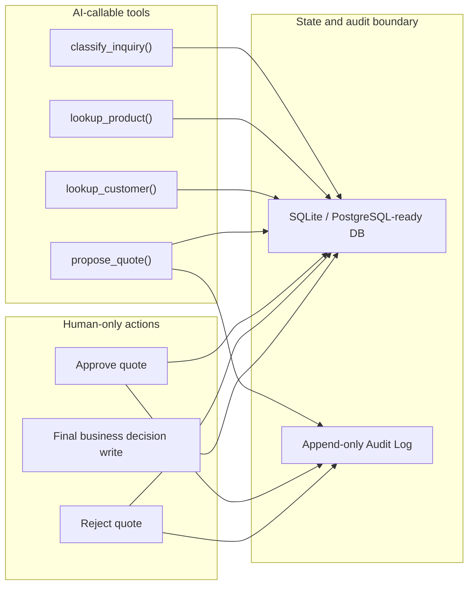

# Omni QuoteGate Architecture

## System Overview

Omni QuoteGate is a FastAPI application that demonstrates controlled ERP sales automation. It receives seeded customer inquiries, looks up mocked ERP data, drafts quotes, routes risky actions for human approval, and records each step in an append-only audit trail.

## Module Overview

- Inquiry Inbox: lists inbound customer requests and their workflow state.
- ERP Lookup Panel: shows matched product and customer credit context from the mock adapter.
- AI Quote Draft: deterministic engine that classifies, looks up, and proposes quote drafts.
- Approval Queue + Audit Timeline: human review surface plus append-only event log.

## AI-Callable vs Human-Only Boundary

The core design principle is that AI can read context and draft a recommendation, but a human must decide risky business actions such as credit-sensitive or stock-constrained quotes.

## Mock ERP Adapter

`app/services/mock_erp.py` exposes product search, customer context lookup, and stock checks behind a clean adapter class. In v1 it reads local database records, but the same contract can be replaced later with Odoo XML-RPC, Oracle/Fusion, SAP, or a custom ERP API adapter.

## Audit Trail Design

Audit events are append-only in application logic. Each meaningful state change writes a human-readable event with JSON payload context so the demo can show how decisions are tracked over time.

## Future Odoo XML-RPC Adapter Plan

The ERP adapter boundary is intentionally narrow: search products, fetch customer context, and check stock. That makes Odoo XML-RPC replacement straightforward without rewriting the approval or audit workflow.

## Reset Demo Note

`POST /admin/reset-demo` exists as a demo-only convenience so the seeded workflow can be restored quickly during portfolio walkthroughs. It is intentionally open in v1 and is not production-safe.
